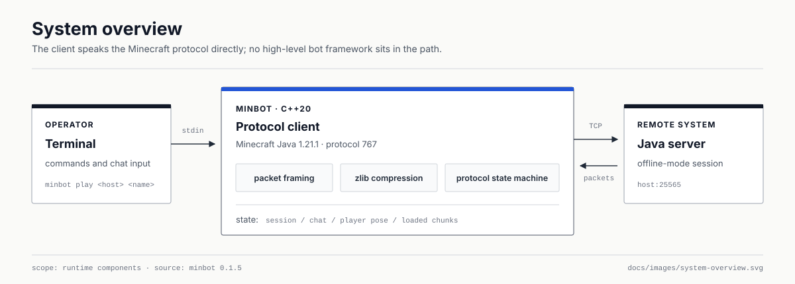
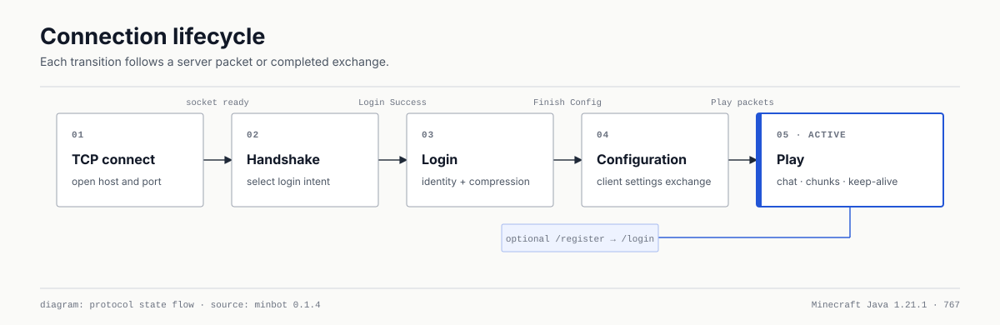
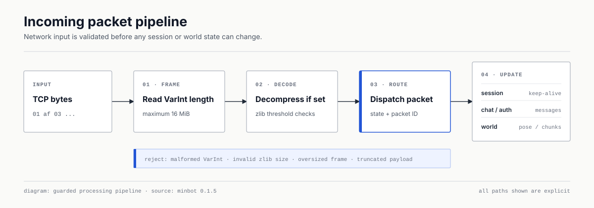

# minbot

Minecraft Java Edition protocol client built from scratch in C++20. The project
explores binary protocols, networking, and autonomous bot behavior without
Mineflayer or another high-level bot framework.

**Current version: `0.1.4` · Target: Minecraft Java `1.21.1` (protocol `767`)**

## How minbot works

minbot speaks the Minecraft protocol directly. There is no Mineflayer or
another high-level bot framework between the C++ client and the server.

### System overview

[](docs/images/system-overview.svg)

The terminal controls a small protocol core, while focused modules keep chat,
authentication, and the known chunk state separate from the network layer.

### Connection lifecycle

[](docs/images/connection-lifecycle.svg)

Every connection advances through explicit protocol states. In play state,
the bot keeps the session alive and handles server events interactively.

### Incoming packet pipeline

[](docs/images/packet-pipeline.svg)

Packet boundaries, compression, and size checks are handled before a packet
can reach chat, authentication, world, or session-state handlers.

## What works in 0.1.4

- Cross-platform TCP connection using system sockets
- Minecraft VarInt and packet framing
- Handshake and server status request
- Raw status JSON output
- Ping/pong latency measurement
- Offline-mode player login through login, configuration, and play states
- Negotiated zlib packet compression at any server threshold
- Configuration and play keep-alive responses
- Teleport and chunk-batch acknowledgements
- Interactive outgoing chat and commands
- Incoming plain player-chat messages
- Basic world model that tracks loaded and unloaded chunk coordinates
- Configurable `/register` and `/login` command templates
- Hidden password input with no password CLI argument
- Defensive parsing and protocol unit tests
- Windows and Linux CI

Microsoft authentication, full NBT chat rendering, block palette decoding,
movement, and pathfinding are not implemented yet. The roadmap never presents
planned features as finished.

## Build

You need CMake 3.20 or newer and a C++20 compiler. The build uses a system zlib
when available; otherwise CMake downloads the SHA-256-pinned official zlib
1.3.2 source release.

```bash
cmake -S . -B build -DMINBOT_BUILD_TESTS=ON
cmake --build build --config Release
ctest --test-dir build -C Release --output-on-failure
```

The executable is normally located at `build/minbot` on single-configuration
generators or `build/Release/minbot.exe` with Visual Studio.

## Usage

```text
minbot --version
minbot status <host> [port] [protocol-version]
minbot play <host> <username> [port] [auth-options]
```

Example for a local test server:

```bash
minbot status localhost 25565
minbot play localhost MinBot 25565
```

The protocol version defaults to `767` for Minecraft Java 1.21.1. The final
argument can still override it when testing another server version.

During `play`, enter a line to send chat, enter a command beginning with `/`,
or enter `/quit` to stop the bot.

## Registration and login plugins

For an existing account, request only the login command:

```bash
minbot play localhost MinBot 25565 --auth login
```

For a new or unknown account, `auto` sends registration and then login. The
default registration format repeats the password:

```text
/register {password} {password}
/login {password}
```

Templates cover servers with different command layouts:

```bash
minbot play localhost MinBot --auth auto \
  --register-template "/register {username} {password}" \
  --login-template "/login {password}"
```

`{username}` and `{password}` are the only supported placeholders. The bot
asks for the password without terminal echo. For unattended local testing it
can read `MINBOT_AUTH_PASSWORD`; the value is never accepted as a command-line
argument or printed. `auto` is a fixed register-then-login sequence rather than
a CAPTCHA or anti-bot bypass.

## Offline-mode server

This release targets offline-mode servers. Packet compression may use the
server's normal threshold; it no longer needs to be disabled.

```properties
online-mode=false
enforce-secure-profile=false
```

Do not expose that server directly to the internet: offline mode does not
verify player identities. Authenticated Microsoft sessions are planned
separately instead of being claimed as working now.

## Project documentation

- [Protocol notes](docs/PROTOCOL.md)
- [Development roadmap](docs/ROADMAP.md)
- [Versioning policy](docs/VERSIONING.md)
- [Changelog](CHANGELOG.md)

## Responsible use

Run minbot only on private servers or servers where automated clients are
allowed. Do not use it to evade anti-cheat systems, spam chat, or disrupt other
players.

## License

This project is released under the [MIT License](LICENSE).
